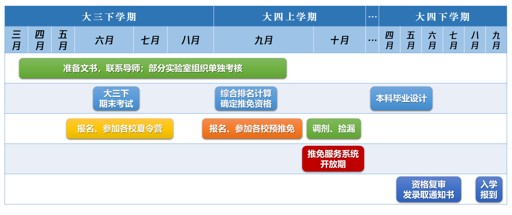

# 何为保研

**保研** = **获得校内名额**(9月底依据政策评审获得) + **获得目标院校院系的录取资格**(参与夏令营，预推免， 九推)

## 总体流程

如图可见，在大三学期的寒假之前，是大家的正常学习，竞赛，科研。在大三的寒假以及之后，则要开始准备保研事宜。

参考博客：[关于保研的ABC（1）一些常识与概念](https://sumsky.top/2021/10/13/baoyan-series-1/)

​				