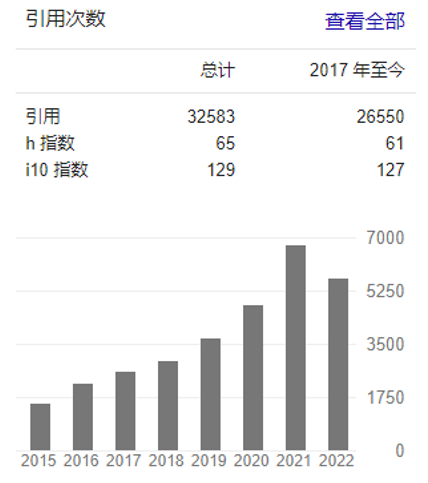

# 学术实力
如果要走学术道路，我认为导师的好坏要大于学校的好坏。一个好的导师，决定着未来三年你能接受的指导，你能拿到的补贴，你论文是否发的出去，你三年甚至五年的研究生生活舒适程度。

建议大家去选学术实力强，**人品好**的老师，选对好的老师，一生都会收益很多。

对于如何了解一个老师的学术实力，可以从几个公开的信息去了解

## 谷歌学术

点击谷歌学术, 输入你要找的导师英文名，找到导师的谷歌学术主页

- **引用量**：一位老师的论文引用次数，可以最直观反应该老师的学术水平。引用量水平在各个专业领域可能不尽相同。
- **h指数**：一个人的h指数是指在一定期间内他发表的论文至少有h篇的被引频次不低于h次。也是可以评判老师的重要指标。

ps：不一定所有老师在谷歌学术上有自己的主页，如果没有找到，可以去[**dblp**](https://dblp.org/), [Aminer](https://www.aminer.cn/), [百度学术](https://xueshu.baidu.com/), [必应学术](https://cn.bing.com/academic?mkt=zh-CN)自行搜索，但是数据不一定有谷歌学术全面，仅供参考。

## 个人主页

一般，我们都能从谷歌学术或者学校网站介绍找到老师的个人主页，找到之后，我们可以看看以下内容

- 是否是教授，是博导最好，博导能够证明学术实力
- 是否是杰青（超级大BOSS），是否优青（业内大佬）
- 是否有学术任职，比如期刊的主编，副编辑，是否是 IEEE Fellow 等
- 是否有国家自然科学基金**重点项目**（很难得），是否有国家自然科学基金项目（有一定学术水平）
- 每年发表A刊的个数（越多越好）
- 是否有很多横向项目（和企业合作，可能让你打工）
- 是否有行政职务（谨慎有行政职务的老师）