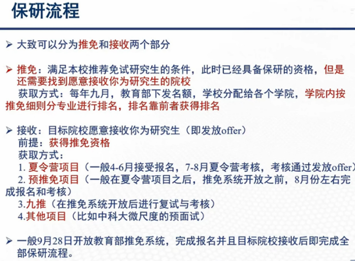
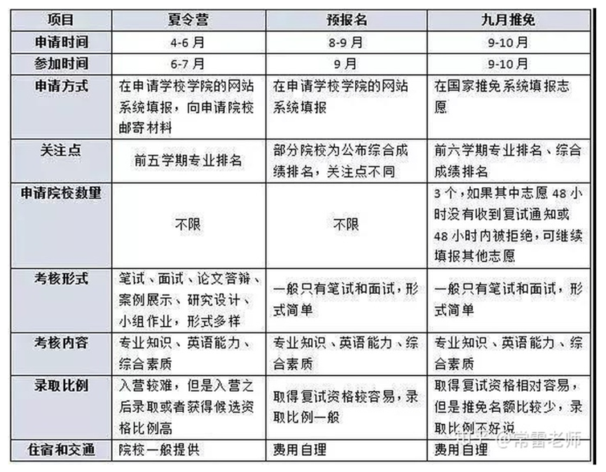
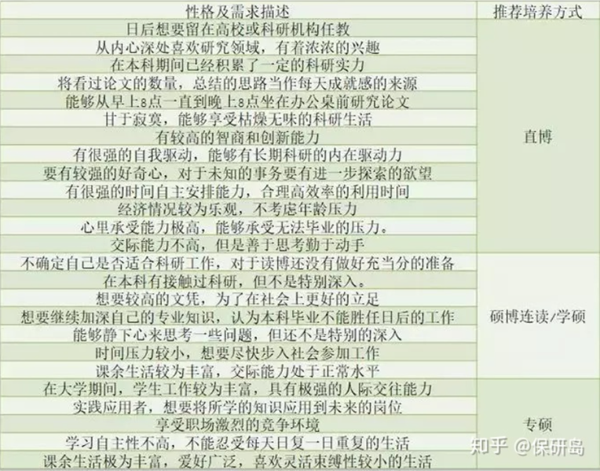
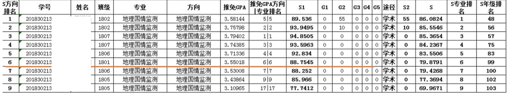
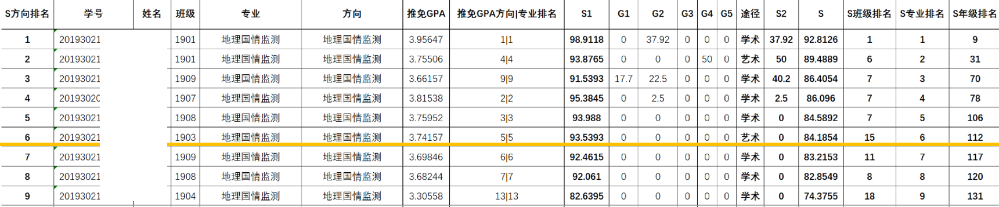

# 保研相关分享

## 保研流程及推免项目区别

**三个阶段获得的offer具有同等效力**，前两个不是所有学校都有（只有夏令营或只有九推），但是是最主要的招生途径。

**夏令营**

- 优势：大部分学校报销费用，并且有充足的时间去了解学校，沟通导师。成功后，基本可以轻松保研，不用再参加9月的激烈竞争。
- 劣势：对本科学校出身要求高，通过几率小。竞争对手一般都非常优秀，不容易脱颖而出。

**预推免**

- 优势：相对于夏令营来说，申请起点要低，竞争难度也会降低。**通过率多数在70%-80%**。不过这个算法对**没有夏令营**的学校来说则不适用。
- 劣势：需食宿自理，相对**时间短**，没有过多精力去了解和沟通。院校多集中，海投容易撞面试时间。

**九推**

- 优势：冲刺理想院校，基本都是在补录时完成的。可以同时选择多所院校，录取几率很大！

- 劣势：名额变少，甚至一些学校不再招收。

**Attention**：

1. **夏令营和预报名都只是“筛选程序”，并不能代替教育部开放的推免系统（即对正式推免的名额有了招收对象）。即便被录取，仍旧需要在九推的时候走正常程序。（很重要！）**

2. 预报名也可以像夏令营一样进行海投，但并不是每个学校都有预报名。

3. 有夏令营的学校不一定有预报名，但没有夏令营的学校很大程度上都有预报名。

4. 有些学校审核是分批次的，需要注意学校的通告并**保持联系畅通**。

5. 大部分学校夏令营和预报名可以同时报，但有些学校是不允许的，应**询问校方：夏令营未通过是否还能继续预报名考核**。

6. 大部分学校**预报名系统往往只能申请一个专业方向**，个别学校可能没有限制，届时请关注相关通告，或致电询问校方。

7. 和夏令营不同，预报名对考研没有任何优惠，只有在拿到保研资格，并在全国系统开启后，填报目标院校，确认拟录取，才会被录取。

8. 九推主要针对在夏令营和预推免中都没申请到心仪院校的补录政策。一般剩余名额不多，适合碰碰运气**捡漏**。

PS：以上信息来源于网络

## 保研申报的四种培养方式

硕士：专硕/学硕

博士：硕博连读/直博

 

专硕科研压力不大，无论文毕业要求，比较看重动手和实践经历；学费稍微贵一点；需要考博士；

学硕科研压力相对博士轻松，有更多时间综合发展；想读博士需要的时间较直博长（3+4>5）；可能缺乏实习经历；

硕博连读为硕士与博士五年一贯制培养（通常为两年硕士+三年博士）。若在转博阶段未通过考试，则继续攻读硕士学位，若成功转为博士，学校在学生满足毕业条件的情况下，一般都会在第5年授予学生博士学位。以硕士身份入学，在前三到四个学期主要进行专业课知识的深入学习，在第五学期进行硕士论文的撰写，学校会组织硕士学位论文答辩并颁发学位证书，在第六学期学校举行转博考试对学生进行筛选，通过的同学进入到下一阶段更深层次的科研训练，直到拿到博士学位。如果发现自己不适合做研究/导师不好有机会退出，拿硕士学位；

直博时间相对短，不需要写硕士论文；有的学校会提供出国深造的机会；刚开始入学时的科研训练难度较高，本科毕业生不太容易接受（所以建议大四期间就要和老师保持联系学习科研事项）。

 PS：以上信息来源于网络

## 私货

### 个人情况

专业：地理国情监测，在学校国际组织与全球治理人才试验班辅修法语和一些国际事务相关课程

排名：保研GPA3.956，方向1/25，年级3/总人数

竞赛：数模国赛省一（16.7)，美赛M（15），外研社阅读比赛校一（6.25）

奖项：国奖、于刚宋晓奖学金、校级优秀干部等

###  国情专业推免情况：

和其他方向比起来压力可能相对小一些。

18级：

19级（http://rsgis.whu.edu.cn/info/1213/10641.htm）：

### 意向：

其实很长一段时间内还是想留在本专业发展，所以大概从寒假开始准备保研的一些材料（看老师、准备简历啥的）还是集中在遥感相关方向。本方向的夏令营报名了北大地空和深圳研究生院的城市规划学院。

四月份的时候在辅修班上听同学聊到了北大汇丰的项目，当时听说的是对理工科的学生很欢迎，其实之前也没有说对经管感兴趣，也没有很多了解，当时可能就是觉得好玩或者可能多一条路吧，所以硬着头皮报名了。

一共就是三个夏令营，可能因为自己比较懒就没打算当海王。没报本校是因为确实不打算留在武大，因为自己是湖北人，研究生还是想到外省去，当然这绝对不是一个成熟的想法，仅供参考。

### 建议：

1. 做科研的话（尤其是博士）**提前找导师**！！！导师很大程度上决定了研究生生涯的幸福程度，每个人根据自己性格的不同未来打算的不同在找导师时，肯定也有不同的指向性。想强调的是一定要动用所有的能力去了解意向院系的意向导师的信息，我能列出的渠道包括学院官网、老师主页及招生信息、论文情况、熟悉的学长学姐、网络评价；

2. “**保研是一场信息战**”，算是第一点的展开。要逐渐开始积累信息渠道，感兴趣的项目往年什么时候在哪里发布入营通知以及这个方向的夏令营自己是否了解全面？有没有往年题库/经验帖？是否足够了解自己可能的面试官？和身边的朋友分享自己的信息；

3. **做好准备，注重细节**。保研是你自己的事，务必提早准备，以认真的态度对待每一个环节。举一些例子：

   	a)    简历：网上找的模板是否合适？字体？行距？复核三遍确保没有错别字，英文版的简历更需要加倍斟酌；
 	
   	b)   和目标院校的联系：怎样写一封好的邮件去和意向导师套瓷、重要的时间节点、需要提交的材料的命名方式/格式/其他要求；
 	
   	c)    面试：除了精心准备的自我介绍之外，抽出大量的时间为一切有可能被问到的问题做准备，问题不嫌多，书到用时方恨少，我认识的有同学准备面试Q&A的PDF就有超过几十页；

4. **学会展示/营销自己**。其实在准备材料的过程当中，也是对自己大学几年的一个梳理，抓住自己的优势并尽可能的表现出来。一方面在材料上有很多可以取巧的地方，比如简历上重要的成绩加粗、奖项旁加上亮眼的获奖率等，另外针对每一个想去的项目，找到你的优势中与它最适配的地方，打动面试官。另外想要补充一点，适度的包装自己是值得鼓励的，一个你满意的课程大作业也完全可以作为你的科研经历，一次你有所收获的但不算成功学生活动也完全可以用来说明你的优点；

5. **弹性地面对变化**。保研是一场马拉松，在各个环节时都有可能遇到好的或者坏的事情，一方面不要轻易骄傲，务必脚踏实地一步一个脚印，另一方面也不要让一次失败影响自己的心态，有可能听起来虚无缥缈，但是结合身边一些同学的保研经历，我觉保持一颗平常心，说起来容易做起来难，但也非常重要。

**祝各位保研之路顺利！**

2023.01.14

